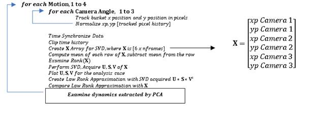
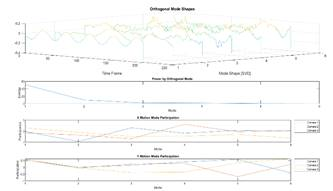

<head>
<meta http-equiv=Content-Type content="text/html; charset=windows-1252">
<meta name=Generator content="Microsoft Word 15 (filtered)">

</head>

<body lang=EN-US link=blue vlink="#954F72">

<h1 style='margin-top:0in;margin-right:0in;margin-bottom:0in;margin-left:2.0in;
margin-bottom:.0001pt;text-indent:.5in;line-height:115%'>Nicolette Lewis</h1>

<h1 align=center style='margin-top:0in;text-align:center;line-height:115%'>AMATH 582:&nbsp;Computational
Methods for Data Analysis</h1>

<h1 align=center style='margin-top:0in;text-align:center;line-height:115%'> Homework 3 </h1>

<h1 align=center style='margin-top:0in;text-align:center;line-height:115%'> February 21, 2020 </h1>

<h1 style='margin-bottom:12.0pt'>Abstract</h1>

<h6 style='margin-bottom:12.0pt;text-indent:.5in;line-height:normal'>The Singular Value Decomposition is a
powerful tool in Linear Algebra which uses diagonalization techniques upon sets
of data to determine power scaling of the primary shapes of dynamics of the
data. In this study, motion of an oscillating bucket was tracked over time
using MATLAB’s Computer Vision Toolbox. The motion was tracked from 3 angles
over 4 tests, each with an increasing component of oscillation (vertical
oscillation, vertical oscillation with noise, pendulum motion and vertical oscillation,
and pendulum motion and vertical oscillation with axial rotation). A Principle
Component Analysis (PCA) was completed on the data sets for each test obtained
from the three camera angles and the primary dynamics of the data was extracted
via decomposition into proper orthogonal modes, which were then projected with
the singular values and modal participations to reconstruct low rank approximations
of the system dynamics. Results from this analysis can be found in Section IV,
Computational Results.</h6>

<h1 style='margin-top:0in;margin-right:0in;margin-bottom:12.0pt;margin-left:
0in;line-height:normal'>Sec. I. Introduction and Overview </h1>

The trajectory of a bucket oscillating in 4 various manners
was recorded from three camera angles. Trajectory data of the bucket was extracted
from these videos by means of MATLAB’s Computer Vision toolbox. Snapshots of
the tracking process can be seen below, in Figure 1, where each subfigure
represents a different camera angle from which the bucket and flashlight were
recorded. The green markers in the figure represent the points that were
tracked over the duration of the videos, whose averages comprise the dataset
upon which the SVD was calculated. These points were chosen by generating an
initial region of interest for MATLAB’s Computer Vision toolbox to identify
features within, then extracting the location of those features over time by
repeating the tracking process throughout the entire video. Figure 2 shows a
representative region of interest for Camera 1, with the colorful blobs within
the ROI being the features that MATLAB identified and tracked. From this
tracking procedure, 12 trajectories were created from the centroid of the
points tracked over the durations of the 12 videos. A GIF animation of the
tracking process can be seen at {insert gif link here};.

 

 

 

 

   

 

 

 

                                                                                                                                                                                      

 

 

 

 

 

 

 

 

 

 

 

 

 

 

 

 

 

 

 

 

 

 

After the bucket
trajectories were obtained, the data was plotted by each test case and manually
time synchronized by matching position minima and maxima between camera
measurements. The videos from which the data was extracted were of different lengths,
so all data was cropped to a length of 200 measurements. Once the data was
cropped and the offset from zero removed, the magnitudes were normalized and
the means of the data were subtracted to create the matrix with which we would
perform the SVD. The cropped and normalized data extracted from the videos can
be seen above in Figure 3. From watching the videos, it is evident that Motion
1 is a simple harmonic motion, dominant in y, with little noise. As a result,
the plots which represent Motion 1 are quite clean, and there are very few
principle components of dynamics to extract. Motion 2 is similar to Motion 1,
with a large degree of added noise introduced via shaking of the cameras.
Motion 3 is a harmonic motion in y, along with a harmonic motion in x. Motion 4
takes Motion 3 and adds an addition degree of rotation about the bucket’s
central axis. The x and y trajectories obtained from each camera were assembled
into a matrix for each Motion, and an SVD was computed upon that matrix. The primary
dynamics extracted from the motions were analyzed, and several lower rank realizations
of the data were made from the decomposition to inspect the effects of dynamic
complexity on the robustness of principle component analysis in identifying
principal orthogonal modes.  These Low Rank realizations and the robustness of
PCA upon extracting the dominant system dynamics are examined in Section IV,
Computational Results.

<h1 style='margin-bottom:12.0pt;line-height:normal'>Sec. II. Theoretical
Background </h1>

The
Singular Value Decomposition, or SVD, is an incredibly powerful tool in linear
algebra which can be used to examine the principle dynamics of data. The
technique uses an expansion of the data into two bases to represent said data
in diagonalized form, with principle components and energies recorded to allow
for reconstruction of the data in a lower rank. According to Kutz, in <u>Data
Driven Modelling and Scientific Computing</u> , for any set of data , “the SVD makes it possible for
every matrix to be diagonal if the proper bases for the domain and range are
used… consider that since U and V are orthonormal bases inand respectively, then any vector in these
spaces can be expanded in their bases.”  In short, what this means is that any
matrix can be diagonalized with the Singular Value Decomposition, as the method
is not contingent on positive definiteness or symmetry of the matrix. The SVD
of something is guaranteed to exist; but the SVD doesn’t necessarily guarantee
that all dynamics within the system will be captured. Careful inspection of the
modal decomposition of the data and energies associated with the proper
orthogonal modes sheds light on the primary dynamics and hidden dynamic behavior.
The multiple bases utilized in the SVD allow for decomposition of a symmetrized
form of the data matrix, . The SVD can be performed with the following
matrix operations, 

<h1 style='margin-top:0in;line-height:normal'></h1>

<h1 style='margin-top:0in;line-height:normal'></h1>

<h1 style='margin-top:0in;line-height:normal'>Post multiplication of the
above results with V and U respectively provides self-consistent Eigenvalue
problems,</h1>

<h1 style='margin-top:0in;line-height:normal'></h1>

<h1 style='margin-top:0in;line-height:normal'></h1>

The
above represents the decomposition of the data into its principle components
and singular values, which can then be used to create low rank approximations
of the data. By examining the singular values and the principle components and
contributions of each principle component to the features of the data analyzed,
we can make inferences about the driving dynamics of the data and interpret the
effects of interactions between components of the data. 

<h1 style='margin-bottom:12.0pt'>Sec. III. Algorithm
Implementation and Development </h1>

            Implementation
of this analysis was started by importing the video frames of the motion of the
oscillating bucket into MATLAB as arrays of RBG images. The images were then
converted to grayscale, and regions of interest were selected to be tracked
over time with MATLAB’s computer vision toolbox. The position of tracked points
upon the bucket over the duration of the video were stored in arrays. The X and
Y positions (in pixels) of the tracked points were averaged for each instance
in time for each camera. Over 4 tests, with 3 cameras, this produced 12 vectors
of average X position, and 12 vectors of average Y position. Time synchronization
of the videos was completed manually, by observing minima and maxima of the
bucket displacement in the primary oscillatory direction. Once the samples were
synchronized and clipped to a consistent length, these vectors were stored in
arrays corresponding to the test they belong to, creating three arrays of size
[6 x 200], where the 6 rows represent X time history of Camera 1, Y time
history of Camera 1, X time history of Camera 2, and so on, over 200 instances
of time. The data was normalized to its maximum absolute value for each test
and component direction, to remove effects of image scale and camera distance
from the object which was tracked upon the dynamics of the data. The data was
then detrended to remove DC offsets from the location of the object varying in
frame betwixt cameras. A Reduced Singular Value Decomposition was completed on
each array of data, and the robustness of the SVD algorithm in extracting primary
dynamics of interest within the data was examined by inspecting the extracted
data mode shapes and energies, as well as the effect of realization rank upon
the reconstruction of the data set. This was done by iteratively realizing the
data with an increasing degree of SVD modes and comparing the SVD projection-realized
displacement histories to the originally sampled displacement histories. An
overview of the algorithm developed for this solution is shown below, in flowchart
format.

 

<h1 style='margin-top:0in;margin-right:0in;margin-bottom:12.0pt;margin-left:
0in'>Sec. IV. Computational Results </h1>

The outputs from the Singular Value
Decomposition upon all four Motions can be seen below in Figures 4 through 8.
The four panels of the figure represent the SVD components for each Motion,
with the columns of U shown in the first subfigure, the values of S^2 in the second
subfigure, and the contributions of the modes to each of the respective camera X
or Y trajectory histories shown in the bottom two subfigures . As can be seen
from the energy plot in Figure 4, Motion 1 can be described almost exclusively
with the first two proper orthogonal modes, as most of the energy of the data
lies within the first two values of sigma. Though the primary oscillatory
motion is in the Y direction, there is variance in the X direction from both
slight camera movement and bucket rotation.

Though Motion 2 is very similar to Motion 1,
and the primary dynamics of the system are extracted successfully with the SVD,
the noise introduced into the data makes it so all modes of the decomposition
possess a non-negligible amount of energy associated with them. Very noisy data
affects the calculation of the SVD, as the errors introduced by squaring the
data to symmetrize it will skew the data by spreading the noise error around
the array. This can be seen in Figure 5, by noting that the energy plot of
Motion 2 does not decrease quickly with mode compared to that of Motion 1 in
Figure 4. There may also be a mode associated with the motion of the cameras
over time, if the camera was shaking in ways that dominated the dynamics of the
data recorded.

Motion 3 (Figure 6) possesses a high degree
of dynamic motion, involving a pendulum processional swinging motion in addition
to the vertical oscillatory motion. The PCA easily extracts the four principle
oscillatory modes (two in X and two in Y) which represent the motion about the x-y
plane and the x and y components of the vertical oscillatory motion. While the
system truly could be expressed with 3 oscillatory degrees of freedom (cylindrical
coordinates), the PCA projects our currently available degrees of freedom into
principle orthogonal modes which represent the motion in what it is given.

Motion 4 (Figure 7) proved difficult to
track, so not much was expected from the results of the PCA. The output was
surprising. The PCA was able to track all of the dynamics aside from the axial
rotation with great fidelity. The axial rotation sampling was highly irregular,
and the original data for the motion is unreliable, so I can’t attest to the
method’s ability to capture the motion.

<html>
<h1 align=center style='margin-top:0in;text-align:center;line-height:115%'> Effect of Rank Increase on SVD Projections of Data </h1>
	

&nbsp;

 

Figure
4: Motion 1 PCA Results

Figure
5: Motion 2 PCA Results

Figure 6:
Motion 3 PCA Results

Figure 7:
Motion 4 PCA Results

Figure 8:
Rank 1 Reconstruction

&nbsp;

&nbsp;

Due to the low number of modes required to
describe the vertical oscillation of the bucket, the y displacement can be reconstructed
very easily with 1 or 2 of the orthogonal modes. The x displacement of the bucket,
and all displacements in the noisy case, require higher rank realizations to be
described fully, as they are the hidden dynamics of the system, overpowered by
the primary oscillation within the y direction. 

&nbsp;

<h1 style='margin-bottom:12.0pt'>Sec. V. Summary and Conclusions </h1>

            This study examined the effects of varying
degrees of dynamics and noise upon the robustness of Principal Component Analysis
via Singular Value Decomposition for a dataset of rank 6. Low rank realizations
were created of the data from its PCA and compared to the original data. The
realizations are incredibly close, and the reconstruction of the data from POD
modes is the best approximation that can be made in the  norm. As the
dynamics of the system become more complicated, or become nonlinear, the POD of
data can lose robustness, and fail to describe existing dynamics within the
data adequately. 
	

<h1><b>Appendix A - MATLAB functions used and brief implementation
explanation</b><b> </b></h1>

detectMSERFeatures             – used to
find points for the vision.PointTracker to follow

extractFeatures                       -
used to hold onto the features that we want to track                   

validPtsObj.Location               - calls
the location of the points that have been tracked       

vision.PointTracker                 - this
is the point tracking function 

mean                                       -
used to calculate the mean of each row of the data matrix, X

svd                                          -
used to perform the singular value decomposition 

<h1 style='margin-top:0in;line-height:normal'><b>Appendix B MATLAB codes</b></h1>
------------------------------------------------------------------------------------------------------------------------------------------------------------
[1] – dataclip.m
------------------------------------------------------------------------------------------------------------------------------------------------------------
 
        %% clipping time histories 
        if ipt==1 && era==2;
            x=x(50:250);
            y=y(50:250);
        elseif ipt==2 && era~=2
            x=x(99:299);
            y=y(99:299);
        elseif ipt==3 && era==2;
            x=x(31:231);
            y=y(31:231);
        elseif ipt==3 && era==3;
            x=x(72:272);
            y=y(72:272);
        elseif ipt==4 && era==2;
            x=x(9:209);
            y=y(9:209);
        else
            x=x(1:201);
            y=y(1:201); 
        end
 
------------------------------------------------------------------------------------------------------------------------------------------------------------
[2] – HW3NikkiLewis.m
------------------------------------------------------------------------------------------------------------------------------------------------------------
		 
		clear all; 
		close all; 
		clc
		set(0, 'DefaultFigureVisible', 'on')
		img=1; % Starting a counter for video frames
		% formatting the data
		doublifyingdata
		load('Grayscale.mat')
		% initializing cell arrays for looping through structure fields
		% and formatting plots
		Cam={{'Camera1'};{'Camera2'};{'Camera3'}};
		subscr={{'a'};{'b'};{'c'};{'d'}};
		style={{'-'};{'.'};{'-.'}};
		 
		% tracking the motion
		MotionTrackHW3
		 
		% assembling the X matrix for SVD
		assembleX
		 
		%% Perform SVD
		SVD_HW3
		 
		%% Low Rank Approximations
		for aprank=1:6;
			figure(9) 
			clf
			figure(10) 
			clf
		for ipt=1:4;
			u=Results.(string(subscr(ipt))).u;
			s=Results.(string(subscr(ipt))).s;
			v=Results.(string(subscr(ipt))).v;
		 
			LRankX=u(:,1:aprank)*s(1:aprank,1:aprank)*v(:,1:aprank).';
			
		   for oo=1:size(LRankX,2)
				LRank(:,oo)=LRankX(:,oo)./max(abs(LRankX(:,oo)));
		   end
		   
			for era=1:3;
				 %% Removing DC Offset from Data (due to camera movement)
				x=detrend(storedpoints.(string(Cam(era))).(string(subscr(ipt)))(1,:))  y=detrend(storedpoints.(string(Cam(era))).(string(subscr(ipt)))(2,:))
				if era==3;
				x=detrend(storedpoints.(string(Cam(era))).(string(subscr(ipt)))(2,:))y=detrend(storedpoints.(string(Cam(era))).(string(subscr(ipt)))(1,:)) 
				end
				
				subplot(2,2,ipt)

		dataclip 
				x=x./max(abs(x));
				y=y./max(abs(y));
		 
				figure(9)
				subplot(2,2,ipt)
				plot(1:(length(y)),y,'k'+string(style(era))); hold on
				xlabel('Frame')
				ylabel('Normalized Displacement (pixels)')
				sgtitle('Y Displacement')
				grid on 
				
				figure(10)
				subplot(2,2,ipt)
				plot(1:(length(x)),x,'k'+string(style(era))); hold on
				xlabel('Frame')
				ylabel('Normalized Displacement (pixels)')
				sgtitle('X Displacement')
			end
			
				figure(9)
				subplot(2,2,ipt)
				c=0;
					v={{'r-'};{'r.'};{'r-.'}};
					for o1=2:2:6;
						c=c+1;
					  
						plot(1:201,LRank(:,o1),string((v(c))))
					end
				xlim([0 201])
				sgtitle('Y Reconstruction')
				legend 1 2 3 1R 2R 3R  
				legend('Location','bestoutside')
				title('Motion '+string(ipt))
				xlabel('Time Frame')
				ylabel('Reconstructed Displacement (px)')
				
				figure(10)
				subplot(2,2,ipt)
				c=0;
					xlim([0 201])
					for o1=1:2:5;
						c=c+1;
					plot(1:201,LRank(:,o1),string((v(c))))
					end
			
				sgtitle('X Reconstruction')
				legend 1 2 3 1R 2R 3R 
				legend('Location','bestoutside')
				title('Motion '+string(ipt))
				xlabel('Time Frame')
				ylabel('Reconstructed Displacement (px)') 
		end
		mkdir('Rank'+string(aprank)+'figures')
		cd('Rank'+string(aprank)+'figures')
		for ff=9:10;
			figure(ff)
		set(gcf, 'Units', 'Normalized', 'OuterPosition', [0, 0.04, 1, 0.96]);
		saveas(gcf,'Rank'+string(aprank)+'figure'+string(ff)+'.png')
		end
		 cd ..
		end
		 
------------------------------------------------------------------------------------------------------------------------------------------------------------
[3] – doublifyingdata.m
------------------------------------------------------------------------------------------------------------------------------------------------------------
		 
		c1.a=load('cam1_1.mat');
		c1.b=load('cam1_2.mat');
		c1.c=load('cam1_3.mat');
		c1.d=load('cam1_4.mat');
		 
		c2.a=load('cam2_1.mat');
		c2.b=load('cam2_2.mat');
		c2.c=load('cam2_3.mat');
		c2.d=load('cam2_4.mat');
		 
		c3.a=load('cam3_1.mat');
		c3.b=load('cam3_2.mat');
		c3.c=load('cam3_3.mat');
		c3.d=load('cam3_4.mat');
		 
		% Doublifying the data
		[xs,ys,~,nframes]=size(c1.a.vidFrames1_1)
		for i=1:nframes;
		Camera1.a(:,:,i)=(rgb2gray(c1.a.vidFrames1_1(:,:,:,i)));
		end
		 
		[xs,ys,~,nframes]=size(c1.b.vidFrames1_2)
		for i=1:nframes;
		Camera1.b(:,:,i)=(rgb2gray(c1.b.vidFrames1_2(:,:,:,i)));
		end
		 
		[xs,ys,~,nframes]=size(c1.c.vidFrames1_3)
		for i=1:nframes;
		Camera1.c(:,:,i)=(rgb2gray(c1.c.vidFrames1_3(:,:,:,i)));
		end
		 
		[xs,ys,~,nframes]=size(c1.d.vidFrames1_4)
		for i=1:nframes;
		Camera1.d(:,:,i)=(rgb2gray(c1.d.vidFrames1_4(:,:,:,i)));
		end
		 
		[xs,ys,~,nframes]=size(c2.a.vidFrames2_1)
		for i=1:nframes;
		Camera2.a(:,:,i)=(rgb2gray(c2.a.vidFrames2_1(:,:,:,i)));
		end
		 
		[xs,ys,~,nframes]=size(c2.b.vidFrames2_2)
		for i=1:nframes;
		Camera2.b(:,:,i)=(rgb2gray(c2.b.vidFrames2_2(:,:,:,i)));
		end
		 
		[xs,ys,~,nframes]=size(c2.c.vidFrames2_3)
		for i=1:nframes;
		Camera2.c(:,:,i)=(rgb2gray(c2.c.vidFrames2_3(:,:,:,i)));
		end
		 
		[xs,ys,~,nframes]=size(c2.d.vidFrames2_4)
		for i=1:nframes;
		Camera2.d(:,:,i)=(rgb2gray(c2.d.vidFrames2_4(:,:,:,i)));
		end
		 
		[xs,ys,~,nframes]=size(c3.a.vidFrames3_1)
		for i=1:nframes;
		Camera3.a(:,:,i)=(rgb2gray(c3.a.vidFrames3_1(:,:,:,i)));
		end
		 
		[xs,ys,~,nframes]=size(c3.b.vidFrames3_2)
		for i=1:nframes;
		Camera3.b(:,:,i)=(rgb2gray(c3.b.vidFrames3_2(:,:,:,i)));
		end
		 
		[xs,ys,~,nframes]=size(c3.c.vidFrames3_3)
		for i=1:nframes;
		Camera3.c(:,:,i)=(rgb2gray(c3.c.vidFrames3_3(:,:,:,i)));
		end
		 
		[xs,ys,~,nframes]=size(c3.d.vidFrames3_4)
		for i=1:nframes;
		Camera3.d(:,:,i)=(rgb2gray(c3.d.vidFrames3_4(:,:,:,i)));
		end
		 
		Camera.Camera1=Camera1;
		Camera.Camera2=Camera2;
		Camera.Camera3=Camera3;
		save('Grayscale.mat','Camera')
	 
------------------------------------------------------------------------------------------------------------------------------------------------------------
[4] – assembleX.m
------------------------------------------------------------------------------------------------------------------------------------------------------------
		 
		for ipt=1:4;
		X=[];
			for era=1:3;
				 %% Removing DC Offset from Data (due to camera movement)
				x=detrend(storedpoints.(string(Cam(era))).(string(subscr(ipt)))(1,:));    y=detrend(storedpoints.(string(Cam(era))).(string(subscr(ipt)))(2,:));
				if era==3;
		x=detrend(storedpoints.(string(Cam(era))).(string(subscr(ipt)))(2,:));
		y=detrend(storedpoints.(string(Cam(era))).(string(subscr(ipt)))(1,:)); 
				end   
				subplot(2,2,ipt)
				%% clipping time histories 
					if ipt==1 && era==2;
						x=x(50:250);
						y=y(50:250);
					elseif ipt==2 && era~=2
						x=x(99:299);
						y=y(99:299);
					elseif ipt==3 && era==2;
						x=x(31:231);
						y=y(31:231);
					elseif ipt==3 && era==3;
						x=x(72:272);
						y=y(72:272);
					elseif ipt==4 && era==2;
						x=x(9:209);
						y=y(9:209);
					else
						x=x(1:201);
						y=y(1:201);
					end
				%% Normalizing data
				x=x./max(abs(x));
				y=y./max(abs(y));
				X=[X;x;y];
			
				%% Plotting stuff
				figure(1)
				subplot(2,2,ipt)
				plot(1:(length(y)),y,'k'+string(style(era))); hold on
				xlabel('Frame')
				ylabel('Normalized Displacement (pixels)')
				sgtitle('Y Displacement')
				xlim([0 201]) 
				figure(2)
				subplot(2,2,ipt)
				plot(1:(length(x)),x,'k'+string(style(era))); hold on
				xlabel('Frame')
				ylabel('Normalized Displacement (pixels)')
				sgtitle('X Displacement')
				xlim([0 201])
				grid on    
			end
			Xs.(string(subscr(ipt)))(:,:)=X'; % storing the X array in a structure
			
				figure(1)
				subplot(2,2,ipt)
				legend 1 2 3  
				title('Motion '+string(ipt))
				 legend('Location','bestoutside')
				figure(2)
				subplot(2,2,ipt)
				legend 1 2 3  
				title('Motion '+string(ipt))
				 legend('Location','bestoutside')
		end
	 
 
------------------------------------------------------------------------------------------------------------------------------------------------------------
[5] – SVD_HW3.m
------------------------------------------------------------------------------------------------------------------------------------------------------------
		for ipt=1:4;
				
		%% SVD 
		DataRank(ipt,:)=rank(Xs.(string(subscr(ipt)))); %get the rank of the data
		 
		[m,n]=size(Xs.(string(subscr(ipt)))); % compute data size
		mn=mean(Xs.(string(subscr(ipt))),1); % compute mean for each column
		 
		Xs.(string(subscr(ipt)))=Xs.(string(subscr(ipt)))-repmat(mn',1,201)'; % subtract mean
		[u,s,v]=svd(Xs.(string(subscr(ipt)))/sqrt(n-1),'econ'); % perform the SVD
		 
		figure(2+ipt)
		 
		subplot(5,3,[1:3,4:6])
		waterfall(u')
		view([45,30])
		xlabel('Time Frame')
		ylabel('Mode Shape [SVD]')
		yticks(1:6)
		title('Orthogonal Mode Shapes')
		shrinkplot
		subplot(5,3,[7:9])
		plot(1:size(s,1),diag(s).^2);
		xlabel('Mode')
		xticks(1:6)
		ylabel('Energy')
		title('Power by Orthogonal Mode')
		shrinkplot
		 
		sgtitle('Test Case ' + string(ipt))
		 
		subplot(5,3,[10:12])
		% surf(1:7,1:4,zeros(4,7),v(:,1:2:end)');
		plot(1:6,v(1:2:end,:)');
		shrinkplot
		% view([90 90])
		xlabel('Mode')
		xticks(1:6)
		ylabel('Participation')
		title('X Motion Mode Participation')
		legend {Camera 1} {Camera 2} {Camera 3}
		 legend('Location','bestoutside')
		 
		subplot(5,3,[13:15])
		% surf(1:7,1:4,zeros(4,7),v(:,2:2:end)');
		plot(1:6,v(2:2:end,:)');
		% view([90 90])
		shrinkplot
		xlabel('Mode')
		xticks(1:6)
		ylabel('Participation')
		title('Y Motion Mode Participation')
		legend {Camera 1} {Camera 2} {Camera 3}
		 legend('Location','bestoutside')
		SingularValues.(string(subscr(ipt)))=diag(s);
		Results.(string(subscr(ipt))).u=u;
		Results.(string(subscr(ipt))).s=s;
		Results.(string(subscr(ipt))).v=v;
		% plot(1:length(lambda),sqrt(lambda))
		 
		end

------------------------------------------------------------------------------------------------------------------------------------------------------------
[6] – MotionTrackHW3.m
------------------------------------------------------------------------------------------------------------------------------------------------------------
		showtracking='nah';
		% initializing frame 1 regions of interest for each video
		% this allows the algorithm to lock onto something and track it
		regions.Camera1.a=[320 220 20 50];
		regions.Camera1.b=[315 290 25 50];
		regions.Camera1.c=[320 280 20 50];
		regions.Camera1.d=[370 265 50 15];
		 
		regions.Camera2.a=[260 265 25 50];
		regions.Camera2.b=[295 335 35 50];
		regions.Camera2.c=[238 285 25 50];
		regions.Camera2.d=[210 225 100 80];
		 
		regions.Camera3.a=[310 260 75 23];
		regions.Camera3.b=[340 245 75 23];
		regions.Camera3.c=[350 210 75 23];
		regions.Camera3.d=[350 210 40 50];
		for ipt=1:4;    % looping over all of the test cases 
			for era=1:3;    % looping over each camera 
			if showtracking=='yes';
			figure
			hold on;
			end
			currset=(string(Cam(era)))+(','+string(subscr(ipt)));   % the test and camera as a string for labelling
			If=Camera.(string(Cam(era))).(string(subscr(ipt)))(:,:,1);  % getting the frame from the grayscaled matrix of images
			if showtracking=='yes';
			imshow(If)
			F(img) = getframe(gcf); % saving frame 
					  img=img+1;    % increment counter
			end
			reg=regions.(string(Cam(era))).(string(subscr(ipt)))(1,:);  % selecting region of interest to be tracked
			regionsObj = detectMSERFeatures(If,'ROI',reg);  % detecting features (IDK how this works lol) 
			[features, validPtsObj] = extractFeatures(If, regionsObj);  % this is some magic 
			if showtracking=='yes';
				If2=insertShape(If,'Rectangle',reg,'Color','red');
				imshow(If2); hold on;
				plot(regionsObj,'showPixelList',true,'showEllipses',false);
				title(currset)
			   
				F(img) = getframe(gcf);
					  img=img+1;
			end
				 trackedpoints=validPtsObj.Location;     % grabbing the points that are valid to track them next frame
				tracker = vision.PointTracker('MaxBidirectionalError',3,'NumPyramidLevels',6); % defining the tracker properties
				initialize(tracker,trackedpoints,If);           % initializing tracker
		 
				[~,~,m]=size(Camera.(string(Cam(era))).(string(subscr(ipt))));  % getting the size of the image
				title(currset)  % setting title of plot
				c=0;
				for im=1:1:m;   % for all of the images 
					c=c+1;
					  Icurr=Camera.(string(Cam(era))).(string(subscr(ipt)))(:,:,im);    % this is the current image
					  
					  if showtracking=='yes';
					  imshow(Icurr);        % show the current image
					  end
					  
					  [points,validity,score] = tracker(Icurr); % gimme them points, computer friend
		 
					  if sum(validity)<=3 || (ipt==4 &&c==10) || (ipt==2 &&c==30); %if you lost track, recapture the points please
						  
						  reg=([xavg(im-1)- reg(3)/2  yavg(im-1)-reg(4)/2 reg(3) reg(4)]);  %look here, computer friend
						  if  era==3 || sum(validity)<=1 ;
						  reg=([xavg(im-1)- reg(3)/2  yavg(im-1)-reg(4)/2 reg(3) reg(4)*1.12]); %broaden your perspective 
						  end
							regionsObj = detectMSERFeatures(Icurr,'ROI',reg,'MaxAreaVariation',3);  % get the regions
		 
							[features, validPtsObj] = extractFeatures(Icurr, regionsObj);   % extract the features
							If2=insertShape(Icurr,'Rectangle',reg,'Color','red');   %inserts rectangle around ROI
							
							if showtracking=='yes';
							imshow(If2); hold on;   % show the current image
		 
							plot(regionsObj,'showPixelList',true,'showEllipses',false); % show tracked points
							F(img) = getframe(gcf); % save frame
							img=img+1;    % increment frame counter
							
							
							end     
							
							trackedpoints=validPtsObj.Location; % getting points from object
		 
							tracker = vision.PointTracker('MaxBidirectionalError',2,'NumPyramidLevels',14); %redefining tracker properties
							initialize(tracker,trackedpoints,Icurr);    %initializing new tracker
							[points,validity,score] = tracker(Icurr); % tracking points
						c=0; % killing counter for reacquisition (tracker reacquires periodically for high noise/rotation cases)
					  end
					  
					  xavg(im)=sum(points(:,1).*score)./sum(score); % acquiring the average point x location for this frame
															   % taking the first
															   % moment with the
															   % statistical score
															   % to weight msrments
					  yavg(im)=sum(points(:,2).*score)./sum(score); % acquiring the average point y location for this frame
		 
					  reg=regions.(string(Cam(era))).(string(subscr(ipt)))(1,:); % defining the ROI again for next frame
		 
					  out = insertMarker(Icurr,points(validity, :),'+');    % display the tracked points on the current image
				
					  if showtracking=='yes';
					  imshow(out); drawnow
					  F(img) = getframe(gcf);
					  img=img+1;
					  end
					  
				end
				
				storedpoints.(string(Cam(era))).(string(subscr(ipt)))=[xavg;yavg]; % saving the average points in a structure for this test and camera angle
								% this will be assembled into X[mxn] later such
								% that the SVD can be computed
					
				plot(xavg,yavg)
				title(currset)
				
				F(img) = getframe(gcf);
				img=img+1;
			end
			
		end
		writerObj = VideoWriter('myVideo.avi');
		  writerObj.FrameRate = 10;
		  % set the seconds per image
		% open the video writer
		open(writerObj);
		% write the frames to the video
		for i=1:length(F)
			% convert the image to a frame
			frame = F(i) ;    
			writeVideo(writerObj, frame);
		end
		% close the writer object
		close(writerObj);

</body>

</html>
